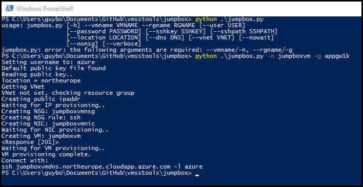

## jumpbox

Creates a new VM in a resource group. You can use this to create a VM in an empty resource group if you want, or use it to create a jump box in an existing VNET to be used to connect to existing resources in the VNET like VM scale set VMs.

```
usage: jumpbox.py [-h] --vmname VMNAME --rgname RGNAME [--user USER]
                  [--password PASSWORD] [--sshkey SSHKEY] [--sshpath SSHPATH]
                  [--location LOCATION] [--dns DNS] [--vnet VNET] [--nowait]
                  [--nonsg] [--verbose]
                  
The following arguments are required: --vmname/-n, --rgname/-g
```

This tool will create a VM in the first VNET it finds in the resource group (or the VNET you specify). If it doesn't find a VNET it will create one.

You can provide a user and password/public key/public key file. If no authentication method provided and no default public key file found it will create a password for you.

By default jumpbox.py will wait for the VM to be provisioned, unless you specify the --nowait argument.

