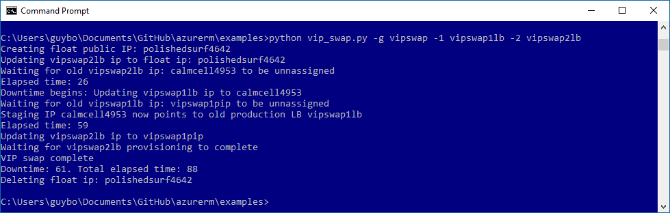

## vipswap

Swaps the public IP addresses between two Azure load balancers.

```
usage: vip_swap.py [-h] --resourcegroup RESOURCE_GROUP --lb1 LB1 --lb2 LB2
                   [--verbose] [-y]
The following arguments are required: --resourcegroup/-g, --lb1/-1, --lb2/-2
```



See also [VIP Swap – blue-green deployment in Azure Resource Manager](https://msftstack.wordpress.com/2017/02/24/vip-swap-blue-green-deployment-in-azure-resource-manager/)

### Installation
  1. Install Python 3.x.
  2. Install the azurerm REST wrappers for Microsoft Azure: "pip install azurerm" (use --upgrade if azurerm is already installed).
  3. Clone this repo locally. 
  4. You need a service principal and tenant ID. See [Authenticating a service principal with Azure Resource Manager](https://azure.microsoft.com/en-us/documentation/articles/resource-group-authenticate-service-principal/) - note that "Reader" access as described in that doc is not enough. It should be "Contributor" or some other roll that allows write access.
  6. Edit azurermconfig.json in the local directory (rename azurermconfig.json.tmpl). Fill in the service principal values for your application (tenantId, appId, app secret, subscription ID).