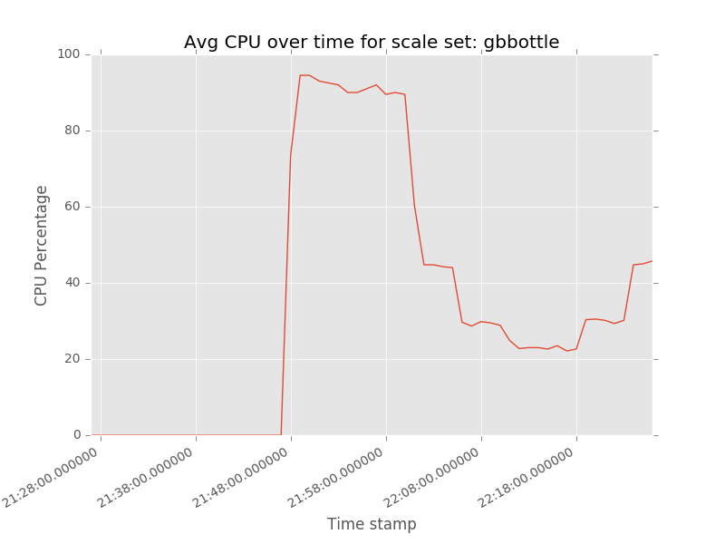

## vmss_cpu_plot

Shows CPU usage graph for a VM scale set.

Usage: vmss_cpu_plot.py [-h] --vmss VMSS --resourcegroup RESOURCE_GROUP [--verbose]

Graphs CPU usage for the named scale set for the last hour.

### Installation
  1. Install Python 3.x.
  2. Install the azurerm REST wrappers for Microsoft Azure: "pip install azurerm" (use --upgrade if azurerm is already installed), and matplotlib library.
  3. Clone this repo locally. 
  4. You need a service principal and tenant ID. See [Authenticating a service principal with Azure Resource Manager](https://azure.microsoft.com/en-us/documentation/articles/resource-group-authenticate-service-principal/) - note that "Reader" access as described in that doc is not enough. It should be "Contributor" or some other roll that allows write access.
  6. Edit vmssconfig.json in the local directory (rename vmssconfig.json.tmpl). Fill in the service principal values for your application (tenantId, appId, app secret, subscription ID).

  
